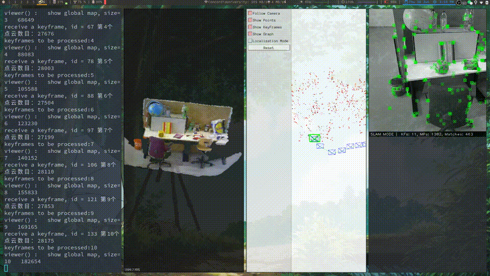

# 基于`ORB_SLAM2` 的`RGB-D`相机稠密建图

本文档是 计算机视觉life [ORB-SLAM2第5期](https://appafc4omci9700.h5.xiaoeknow.com/v1/goods/goods_detail/term_634260915e015_SerHfL?type=3) 大作业。会给出代码框架，搜索代码中TODO 部分，并完成相应功能的代码。最后会统一讲解大作业思路（不会直接给答案）。请大家务必自己动手实现，算是一个小的项目，对个人能力提升帮助很大。

大家可以在我们课程专属答疑群里交流思路，沟通遇到的问题。

本次作业权重很大，是最终评定课程优秀学员（全额退款，发放证书）的重要参考。


## 在开始之前的准备工作

### 确认编译环境

**注意:** 无论使用的是`ubuntu18.04` 还是`ubuntu16.04`, 强烈建议使用`PCL 1.7.2`版本的点云库

- 实测`ubuntu18.04` apt 安装的`pcl-1.8`会出现段错误(当然也有可能是我的电脑软件环境比较复杂的原因～)
- 编译安装`pcl-1.7`参考[pcl 官网的编译安装步骤](https://github.com/PointCloudLibrary/pcl)

### 准备数据集

我们使用`TUM`的`RGB-D`数据集：将其下载下来放在项目目录的`TUM_dataset/`下, 没有就新建一下
具体可以参考`run_rgbd_dense_map.bash`文件中的命令的路径。

### 准备字典文件

如果没有字典文件， 那么再去下载：
[字典文件](https://github.com/raulmur/ORB_SLAM2)

## 编译整个项目

```bash
     chmod +x build.sh
     ./build.sh
```

### 只编译`ORB_SLAM2 Dense_Map`

```bash
    mkdir build
    cd build
    cmake ..
    make -j
```

## 运行 rgbd 稠密建图

```bash
    bash run_rgbd_dense_map.bash
```

运行效果：


检测到回环之后的点云调整, 红框之中的文字输出是回环之后点云调整完毕之后的提示信息， 详见代码：


## 代码思路

- 添加一个`PointCloudMapping` 类并创建一个线程对`关键帧`的点云信息进行处理和显示
- `Tracking` 线程将关键帧插入`PointCloudMapping` 关键帧队列
- `LoopClosing` 线程将在检测到回环之后通知`PointCloudMapping`进行点云调整。

## 大作业内容

看懂线程之间的调用关系， 使用`PCL`点云库进行点云操作， 最终补全代码的相关内容， 详情参见代码中的
`PointCloudMapping.cc`文件， 根据提示以及功能描述补全`TODO:`。

需要改动， 补全的文件：

- `src/PointCloudMapping.cc`
- `src/Tracking.cc`
- `src/LoopClosing.cc`
